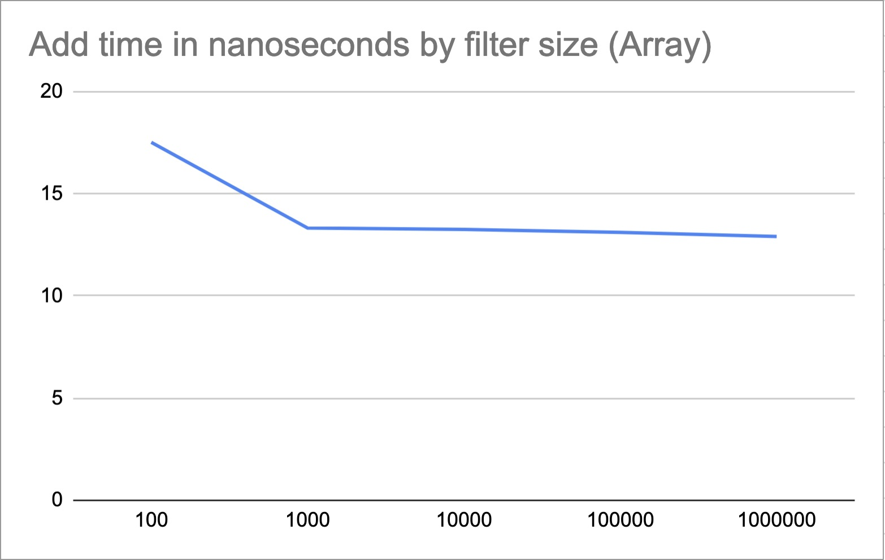
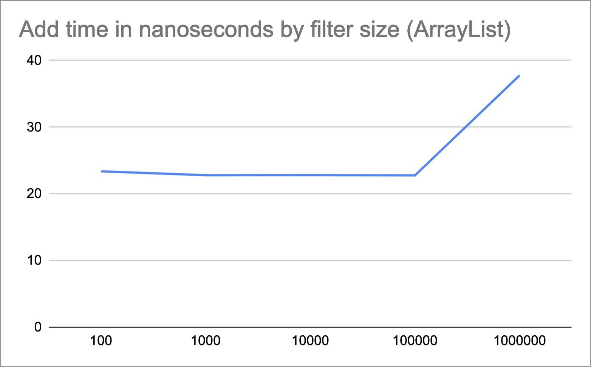
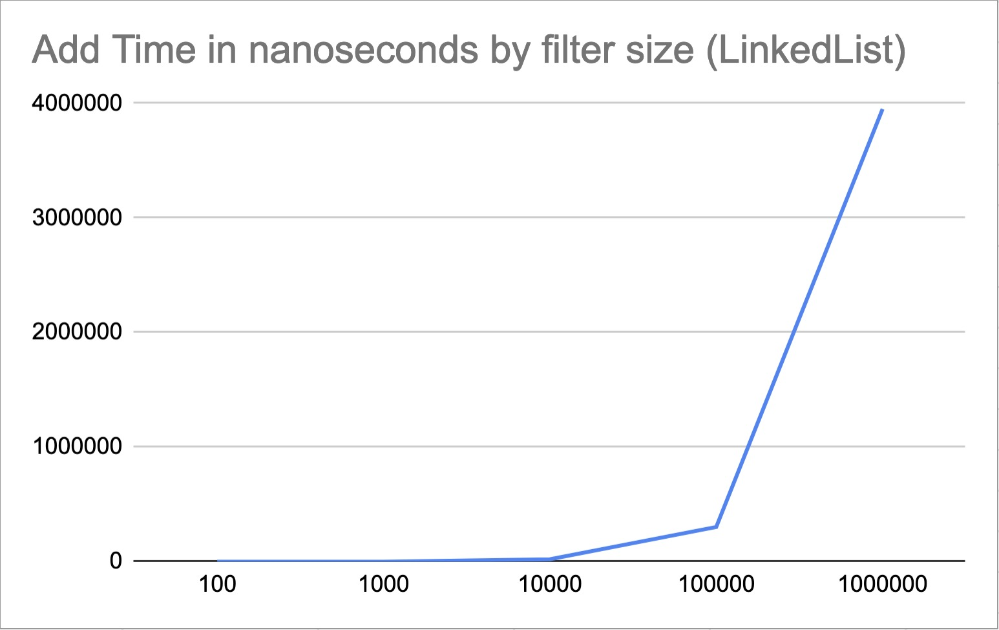
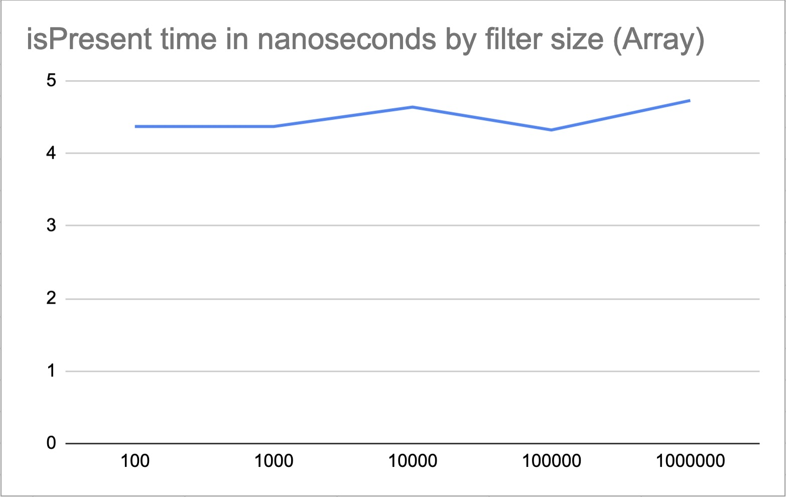
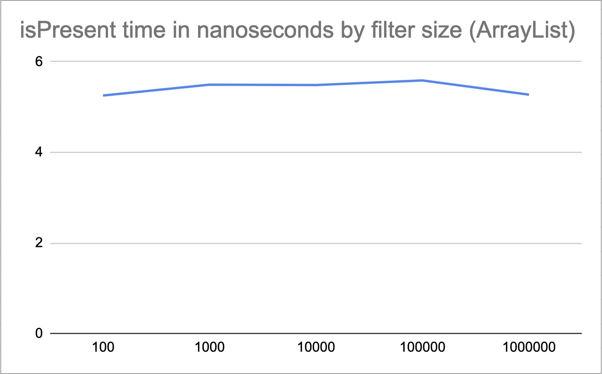
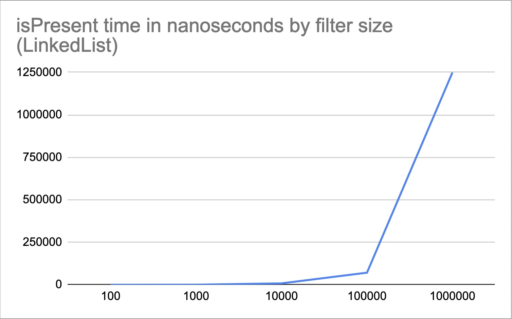
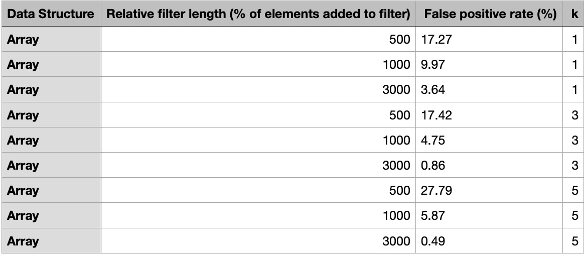
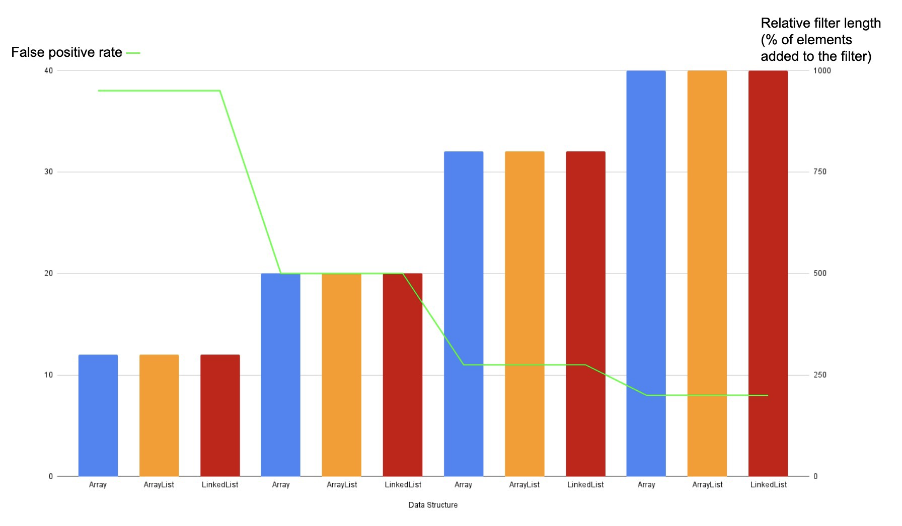

# My introduction to bloom filters — and JMH.
>A project introducing myself to bloom filters, conducted during the first 
>semester of my second year as a CS student. As I had to benchmark my code, 
>I decided to learn how to use JMH. 


## Specifications & Run instructions
This project is fully written in Java with Maven as project manager. However, I don't recommend launching the project 
with Maven. Because I haven't built it to work that way, it certainly won't work.

Use your favourite development interface and start the main function in the Main class.
Doign so will launch the Benchmarks. Be aware that this will take some time. Expect it to take 5 minutes or more with 
the default configuration.

After completion of the execution, two CSV files should have been generated, which are the results of all benchmarks conducted.  

## What is a Bloom filter ? And how is it implemented here ?

### Short explanation
A Bloom filter is a data structure having a list of bits that can do two things. 
- Check that an object *is not* in the filter with a **100% probability**
- Check that an object *is* in the filter with **a certain probability < 100%**

Note that this means a Bloom filter can return a *False positive* check.

"But how is this certain probability defined ?", you might ask. That is the fun part. We will talk about that a little bit later.
First, allow me to explain how to add an object to a bloom filter. It's actually quite simple !

At the beginning of the process, we must decide the <ins>**k**</ins> of the bloom filter we're working with.
The k of a Bloom filter is the **number of hash functions** it uses to store objects.

When an object is getting added to the filter, the filter generates *k* hashes of the object and passes all corresponding
bits to 1. Of course, the hashes are being applied a modulo of the length of the array to always be in range of 
the filter's bit array. 

For example, if a bloom filter starts with a bit list of [0,0,0,0,0,0,0,0,0,0], the filter has k=2, and we want to add an object.
Let's say the object's hashes are 61 and 34. In this case, the filter will be updated to [0,1,0,0,1,0,0,0,0,0].
With all that said, this is just a very short introduction. To get a better understanding of this probabilistic data structure,
I recommend getting a look at the <a href="https://en.wikipedia.org/wiki/Bloom_filter">Wikipedia article</a> on the matter.

### Implementation 

Three Bloom filters exist in this project : 
- [BloomFilterArray](src/main/java/bloomfilter/BloomFilterArray.java), using a java array to store its bit set 
- [BloomFilterArrayList](src/main/java/bloomfilter/BloomFilterArrayList.java), using an ArrayList to store its bit set 
- [BloomFilterLinkedList](src/main/java/bloomfilter/BloomFilterLinkedList.java), using a LinkedList to sotre its bit set
>*It's easy, isn't it?*

Now, I will explain as best as i can how I implemented these filters. 
You can look at the code directly and read the documentation, it should help you understand. 

All three bloom filters implement the same methods. That's why 
[an interface](src/main/java/bloomfilter/BloomFilterInterface.java) with these methods 
makes up the base of all filters. 
```java 
public interface BloomFilterInterface {

    public void add(Object object);

    public boolean isPresent(Object object);
}
```

The only difference between all the filters is the data structure used to represent the bit set of the filters. 

That's why you will find 
```java 
final private int[] bitArray;
```
For the Bloom filter using a java array; 

```java 
final private ArrayList<Integer> bitArray;
```
For the bloom filter using an ArrayList; 

```java 
final private LinkedList<Integer> bitList;
```
For the Bloom filter using a LinkedList.


The **k** and the **length** of all Bloom filters are passed as arguments in the constructor. Once set, they cannot be 
changed. So be aware that if you want to change them, you will have to create new filters. 

The implementation of the ```add(Object)``` functionality is basically the same for each filter type : 

```java 
    @Override
    public void add(Object object) {
        if (object == null) {
            System.err.println("There was an error whilst adding an element to the filter; object can't be null.");
            return;
        }
        for (int hashID=1; hashID<=k; hashID++) {
            //ADD THE HASH OF THE OBJECT TO THE FILTER'S ARRAY
        }
    }
```

And the ```isPresent(Object)``` method doesn't look very different : 
```java 
    @Override
    public boolean isPresent(Object object) {
        for (int hashID=1; hashID<=k; hashID++) {
            if ((/* THE ELEMENT IN THE FILTER'S BIT SET AT THE GENERATED HASH MODULO THE LENGTH OF THE BIT SET */) == 0)
                return false;
        }
        return true;
    }
```

When running an ``isPresent(Object)`` method, it returns false if at least one bit of the filter's bit set associated to 
a hash of the object is zero, which means that the object hasn't been added to the filter.

However, if all filter's bits at hashes of the object are set to 1 by other objects, it can return true even though 
the tested object hasn't been added. This scenario is called a **superposition**.

Notice how the amount of hashes checked (and added) depends on the **k** of the filter.

#### Hashes 

Talking about hashes, the way I chose to implement them is very simple as well. 

There is a [MyHash](src/main/java/bloomfilter/MyHash.java) class implementing a single function : ```hash(object o, int n)``` 
where `o` is the object to hash and `n` the *iteration in which the hash is used*. For instance, the implementation of 
the add functionality for the ``BloomFilterArray`` is the following : 

```java 
    @Override
    public void add(Object object) {
        if (object == null){
            System.err.println("There was an error whilst adding an element to the filter; object can't be null.");
            return;
        }
        for(int hashID=1; hashID<=k; hashID++){
-->         this.bitArray[abs(MyHash.hash(object, hashID) % this.arrayLength)]= 1;
        }
    }
```

The hash function does nothing really special. It takes java's ``.hash()`` and multiplies it by ``n``, except for negative
integers, where it first multiplies it by a prime number, so that opposite numbers don't have the same hash.

## Benchmarking the filters 

> First, what does it mean ? 
> For this project, we want to measure how long operations take to execute, and the error rate (False positive) filters 
> have.
> 
> That's to say, we want to know which of them is the most efficient (takes the the least amount of time)
>

All benchmarks — be they JMH or error rate, are done in the [MyBenchmark](src/main/java/benchmark/MyBenchmark.java)
class.

Be aware that any file at the project's root called either `error_rate_results.csv` or `jmh-result.csv` will be overwritten.

The False Positive rates are done by hand, and the performance benchmark is done with JMH.


## What's JMH and why did I choose it ? 

JMH is a well-known Java library implementing easy-to-use benchmarking. 
I'm well aware that my benchmarks could have been done without this library, by proceeding with `System.nanoTime()`. 
However, I thought it'd be a good idea to learn the best way of doing so in Java. 

Hence, the time benchmarks are done with JMH, which evaluates how much time the system takes to perform operations given to 
the test method. 

### Implementation of JMH Benchmarks 

Each filter has a test for their `add` and `isPresent` method. For instance, BlooomFilterArray's benchmark method for 
`add` is the following : 

```java 
    @Benchmark
    public void time_add_array(Blackhole bh){
        bloomFilterArray.add(938407180.92364);
        bh.consume(bloomFilterArray);
    }
```

As you can see, the `@Benchmark` annotated method does one single thing : add a float to a bloom filter's bit array, 
and then "consumes" the filter. Essentially, this prevents Java's runtime environment to handle the 
bloomFilter object, which prevents any useless computation time done by the latter.


### Results

> All results here were conducted on the same machine, a M1 Macbook Air. It is normal for the benchmark results to be 
> different on your machine, as all machines don't have the same processing power. 

#### Time performance 

As to time performance, the results are the following.









#### False positive rate 

As to the false positive rate according to `k` and the filter's length, the results are the following 

*Note : the amount of elements added to the filter is 10 000. The results displayed are only for the array data structure
because it makes no sense to display the others, as they have almost exactly the same rates.*



For instance, with `k` = 3, the following graph can be drawn : 



We can directly notice that the data structure does not have an impact on the error rate of a filter.

### Conclusion 

With little surprise, the LinkedList data structure struggles to efficiently add objects to their list. 
As soon as the filter's list length exceeds 10 000, the time it takes to add an element explodes and goes to the hundreds
of thousands of nanoseconds.
This is because to access the 80th element of the data structure, you *have to* iterate over all 79 precedent bits. 
That takes time and processing power, which reverberate on the overall time the method takes to add an object to the filter.

Array and ArrayList, however, manage to add elements within 40 nanoseconds, although array has a little advantage over ArrayList.
I presume this advantage comes from the fact that array is a primitive type, and hence better optimpized.

Concerning the isPresent functionality, the results are not that different. 
Whilst LinkedList explodes the same way from 10 000 length, array and ArrayList execute the method in repsectively ~4.5
and ~5.5 nanoseconds, regardless of filter size — for the same reasons stated for the add functionality.

How can we interpret the false positive rates results? 
First, what we can see is that the longer the filter, the less it's likely to return false positive verifications.
A filter with a length of 3000 and a filter with a length of 1000 having the same `k` will always procude the same result; 
the 3000 one is more accurate. 

However, we can't conclude the same for `k`. In fact, we can see that for a relative length of 500, a `k` of 5 will return 
more false positives than a `k` of 3. That's easily explained by the fact that if a single adding uses that much bits, 
other hashes will collide with it and return a false positive. 
This is why a formula for the optimal `k` exists. However, this is not implemented here. 


Overall, we can conclude that LinkedList is absolutely not suited to be the data structure of a Bloom filter, 
unless you *want* it to take large amounts of time to add a single object to your filters. 
On the contrary, array seems to way to go, as the benchmarks clearly indicate it performs the best overall, without great variation
at all depending on the array length.

As to the reliability of the filters, one thing is sure : the longer it is, the better. As long as `k` is not too large as well.